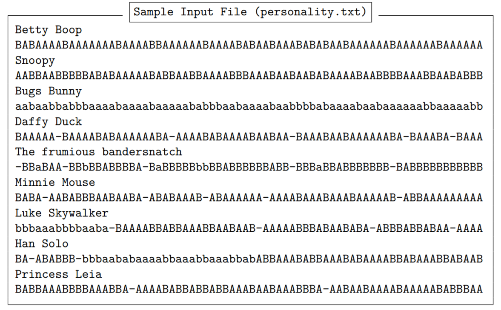
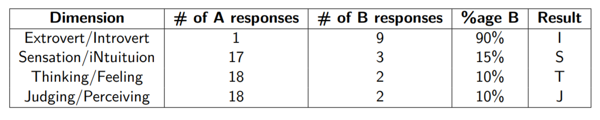
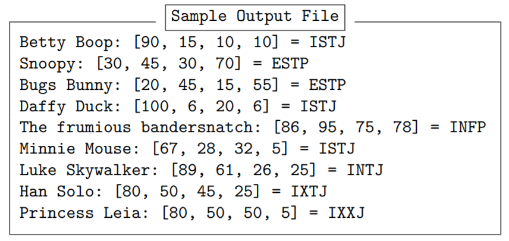

# PersonalityTest-FileProcessing
It is a program that determines people's Keirsey personality type. This focuses on file input and output, String processing, and arrays. 
# About
## Program Behavior Overview
- This program will process an input fil containing the results of a personality test for a number of people and determine each person's Keirsey personality type. 
- The program will begin by printing a short introduction, and then asking the user for an input file to read and an output file to print results to.
- The program will then read the given input file and process
the responses to the personality test in that file, printing the results to the specified output file. Only the
introduction and file prompting) should be printed to the console.

## Test Format
- The Keirsey test involves 70 questions, each of which can be answered either "A" or "B" (case-insensitively).
Each question related to one of the four dimensions (see below), and each answer corresponds to one
option or the other for that dimension. The "A" answers correspond to extrovert, sensation, thinking,
and judging (the left-hand types in the list above), whereas the "B" answers correspond to introvert,
intuition, feeling, and perceiving (the right-hand types in the list above). Questions can also be skipped,
indicated by a response of "-".

- here is a sample input file (personality.txt)

- The 70 questions in the Keirsey test are organized in ten groups of seven questions each. The first question
in each group (i.e. questions 1, 8, 15, etc.) is related to the Extrovert/Introvert dimension. The next two
questions in each group (questions 2 and 3, 9 and 10, 16 and 17, etc.) are related to Sensation/iNtuition.
The next two questions (questions 4 and 5, 11 and 12, etc.) are related to Thinking/Feeling. The final
two questions in each group (questions 6 and 7, 13 and 14, etc.) are related to Judging/Perceiving. Each
person’s responses will be provided in question order. That is, the first response is from question 1, the
second response from question 2, and so on. As stated above, each response will be either "A" or "a"
(for the "left-hand" response), "B" or "b" (for the "right-hand" response), or "-" (if the person skipped
that question).

## Determining Personality Type
- For each of the four dimensions, we determine the percentage of responses the person gave for that
dimension that were "B" (rounded to the nearest integer). Smaller percentages indicate the person is
closer to the "A" personality type for that dimension, while larger percentages indicate the person is closer
to the "B" side. For each person in the input file, your program should output the person’s name, the
percentage of responses they gave for each dimension that were "B", and their overall personality type.
See the sample output file below for the specific format.

- For example, consider the first person in the sample input file personality.txt, named Betty Boop.
This person’s responses are as follows:

- For each dimension, we count the total number of responses given, then determine the percentage of
those responses that were "B". Based on this percentage, we assign the person to one side or the other of
the dimension. If the percentage is less than 50, we assign them to the "A" side (the first option in each
pair); if the percentage is greater than 50, the person is assigned to the "B" side (the second option in
each pair). So, for example, Betty Boop has 90% "B" responses in the E/I dimension, so she is assigned
to Introvert. On the other hand, she has only 15% "B" responses in the S/N dimension, so she is assigned
to Sensing. It is also possible for a person to have exactly 50% "B" responses. In this case, the person is
Page 2 of 6 evenly split between the two sides of the dimension, and they are assigned "X" for that dimension. (See
the sample input file for examples of this.)

- Questions that were skipped (i.e. those
that have a response of "-") are considered
as neither A nor B responses and should
not be included at all in the percentage
calculation. So, for example, if a person
skipped the first question on the test, they
would only have 9 responses for the E/I
dimension, rather than 10. If 6 of their
responses were B, their percentage of B
responses would be 6/9 ≈ 67%, not 60%.
See the sample input and output files for more examples.

- Here is a output file sample

